# BotFrameworkWithComputerVision
---
## 1. Prerequisites
 - Register Azure account
 - Install Visual Studio 2017 for Windows.
---
## 2. Create Function App for uploading image
### 2.1. Create Function App in Azure
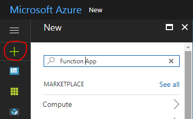  
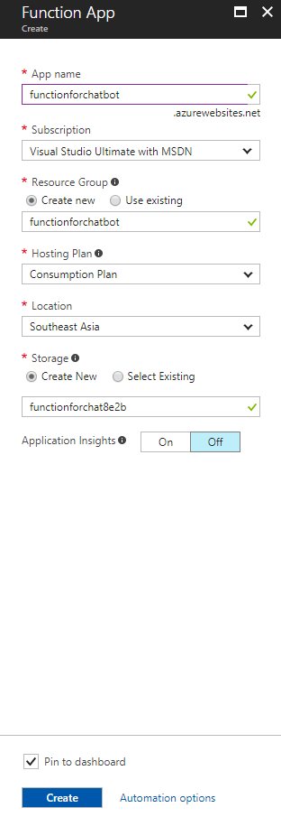
### 2.2. Create Blob storage in Azure
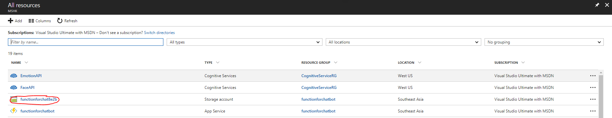
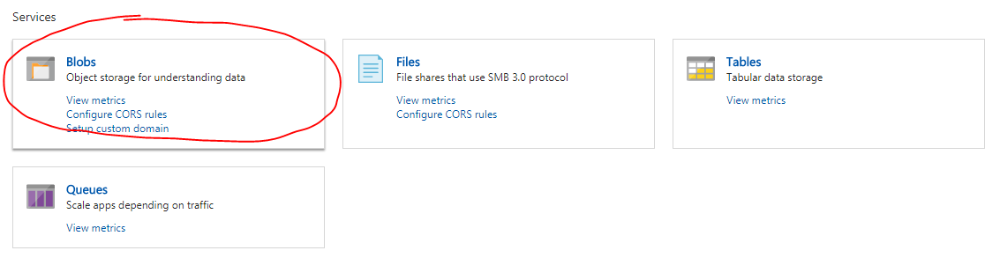
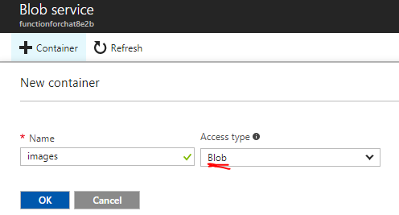
###### Copy the connection string in Access key
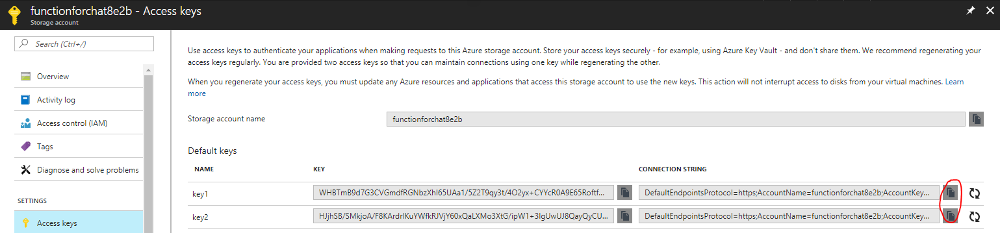
### 2.3. Add new function in Function App
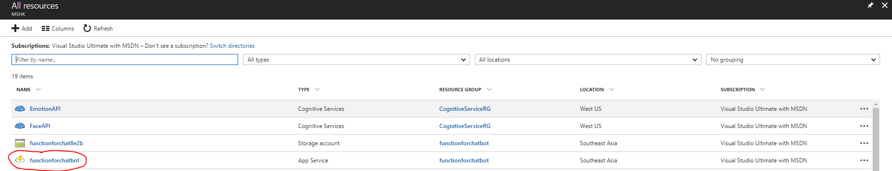
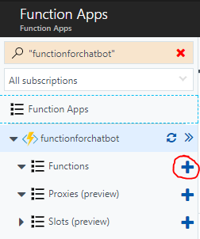
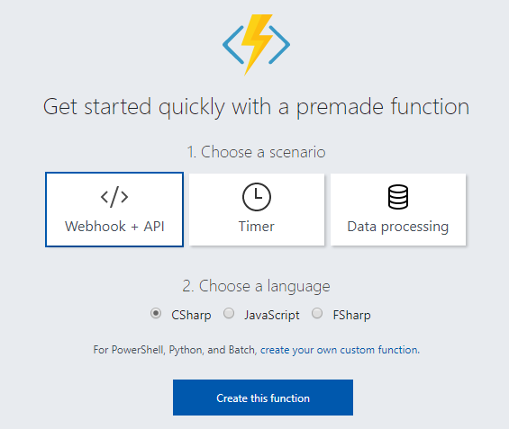
### 2.3. Edit the function and get url
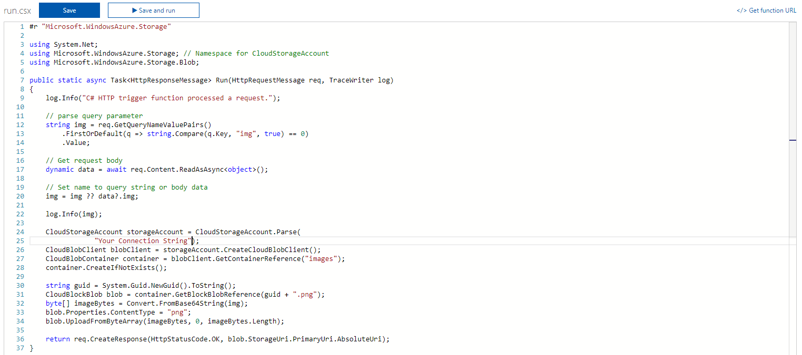
###### Remember to paste the connection string in the code
```cs
#r "Microsoft.WindowsAzure.Storage"

using System.Net;
using Microsoft.WindowsAzure.Storage; // Namespace for CloudStorageAccount
using Microsoft.WindowsAzure.Storage.Blob;

public static async Task<HttpResponseMessage> Run(HttpRequestMessage req, TraceWriter log)
{
    log.Info("C# HTTP trigger function processed a request.");

    // parse query parameter
    string img = req.GetQueryNameValuePairs()
        .FirstOrDefault(q => string.Compare(q.Key, "img", true) == 0)
        .Value;

    // Get request body
    dynamic data = await req.Content.ReadAsAsync<object>();

    // Set name to query string or body data
    img = img ?? data?.img;

    log.Info(img);

    CloudStorageAccount storageAccount = CloudStorageAccount.Parse(
                "Your connection string";
    CloudBlobClient blobClient = storageAccount.CreateCloudBlobClient();
    CloudBlobContainer container = blobClient.GetContainerReference("images");
    container.CreateIfNotExists();

    string guid = System.Guid.NewGuid().ToString();
    CloudBlockBlob blob = container.GetBlockBlobReference(guid + ".png");
    byte[] imageBytes = Convert.FromBase64String(img);
    blob.Properties.ContentType = "png";
    blob.UploadFromByteArray(imageBytes, 0, imageBytes.Length);

    return req.CreateResponse(HttpStatusCode.OK, blob.StorageUri.PrimaryUri.AbsoluteUri);
}
```
###### Then copy the function URL by clicking "</>Get function URL"
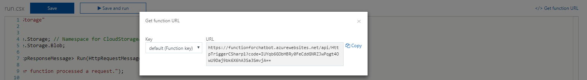
---
## 3. Register Computer Vision API
### 3.1. Create Computer Vision API in Azure
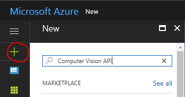
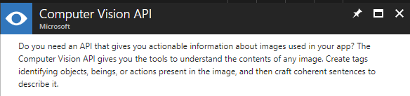
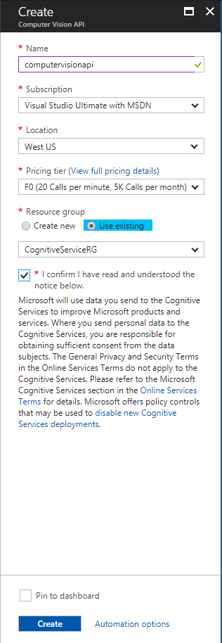
### 3.2. Go to the Computer Vision API and get Access key

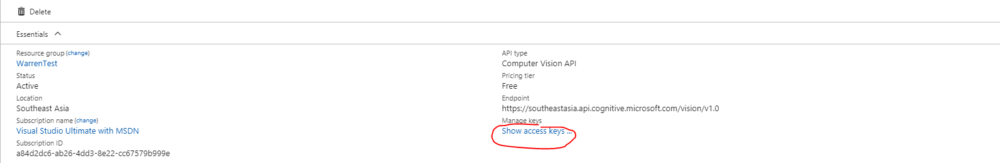

---
## 4. Download the project and test
###### Make sure you have changed the API url and subscription key in RootDialog.cs
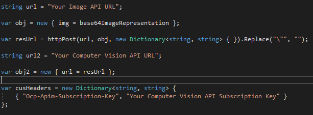
---
## 5. Outcome
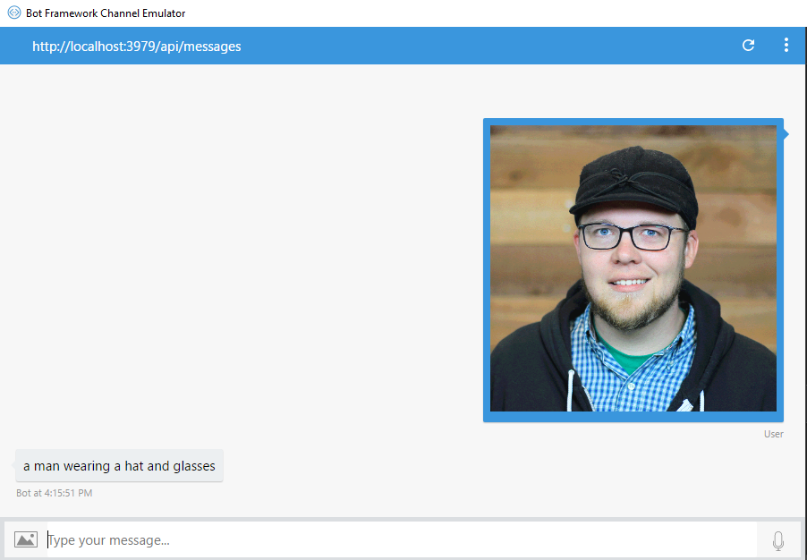

